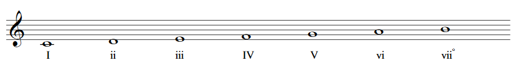
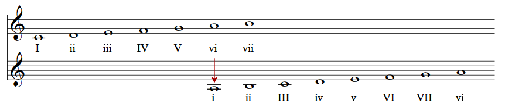
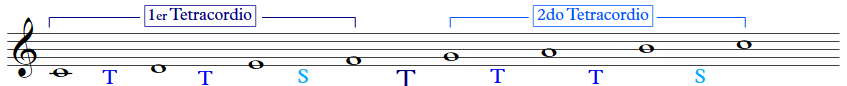
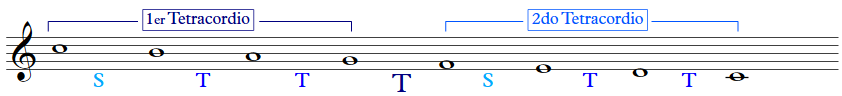
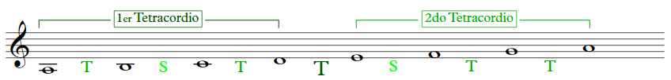
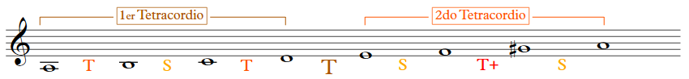
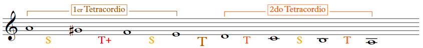
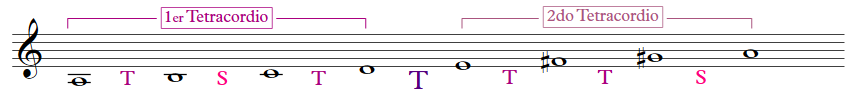
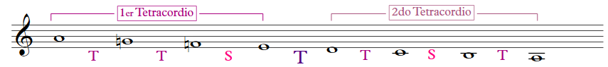

# :musical_score: Teoría de las escalas.

## ¿Qué es una escala?

Una escala es una sucesión de notas contiguas. Es decir, una secuencia de notas que van en un orden determinado. 
> *Una nota detrás de la otra.*

*Se dice que la palabra Escala proviene del Italiano "Scala", que significa escalera.* 

La escalas tienen tres características principales:

- **Siete notas**: comenzando en una en particular.
- **Dirección**: ascendente y descendente.
- **Estrcuctura**: se refiere a la forma de ordenar los tonos y semitonos.

# Escalas mayores y menores

Las escalas más comunes son las mayores y menores. 

Las notas de las escalas se identifican por grados.
Por ejemplo:

||
|:--:|
| |
| Fig. 1 Grados de una escala mayor|

Las escalas menores se relacionan directamente con las mayores, pues comienzan a partitr del sexto grado de una escala mayor.

||
|:--:|
| |
| Fig. 2 Escala relativa menor|

A continuación se muestra el orden de tonos y semitonos de las escalas mayores y menores.

|Escala|Dirección|Tetracordio 1|Unión|Tetracordio 2|Imagen|
|:--|:--|:--|:--|:--|:--|
|Mayor|Ascendente|**T**ono, **T**ono, **S**eminitono|**T**ono|**T**ono, **T**ono, **S**eminitono||
|Mayor|Descendente|**S**eminitono, **T**ono, **T**ono|**T**ono|**S**eminitono, **T**ono, **T**ono||
|Menor natural|Ascendente|**T**ono, **S**eminitono, **T**ono|**T**ono|**S**eminitono, **T**ono, **T**ono||
|Menor natural|Descendente|**T**ono, **T**ono, **S**eminitono|**T**ono|**T**ono, **S**eminitono, **T**ono||
|Menor armónica|Ascendente|**T**ono, **S**eminitono, **T**ono|**T**ono|**S**eminitono, **T**ono **a**umentado, **S**emitono||
|Menor armónica|Descendente|**S**eminitono, **T**ono **a**umentado, **S**emitono|**T**ono|**T**ono, **S**eminitono, **T**ono||
|Menor melódica|Ascendente|**T**ono, **S**eminitono, **T**ono|**T**ono|**T**ono, **T**ono, **S**eminitono||
|Menor melódica|Descendente|**T**ono, **T**ono, **S**eminitono|**T**ono|**T**ono, **S**eminitono, **T**ono||

## Estudio de escalas para piano

El compendio del estudio de las escalas mayores y menores se encuentran en el libro de "El pianista virtuoso" (The Virtuoso Pianist), en el estudio No. 39. 

# :books: Referencias

- Gotham, M. et al. *OPEN MUSIC THEORY.* Recuperado de: [https://viva.pressbooks.pub/openmusictheory/open/download?type=pdf](https://viva.pressbooks.pub/openmusictheory/open/download?type=pdf)
- [¿Qué es una escala musical?](http://www.laescala.com.mx/blog/que-es-una-escala-musical#:~:text=Una%20escala%20musical%20es%20un,m%C3%A1s%20bajo%20que%20el%20anterior.) Recuperado de [laescala.com.mx](http://www.laescala.com.mx/)
- [The Virtuoso Pianist \(Hanon, Charles-Louis\)](https://imslp.org/wiki/The_Virtuoso_Pianist_(Hanon%2C_Charles-Louis)) Recuperado de [imslp.org](https://imslp.org/)